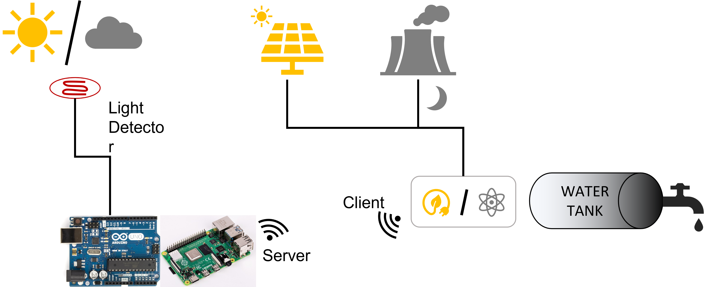

# RaspberryPi for the energy-saving and heat watering system.

It has been for a long time since I have solar panels installed on the roof of my house, in such a way that I can use solar energy for my daily purposes. Unfortunately, I do have not a battery system to store the excess energy to reuse it when is cloudy or during the night. On the other hand, my electricity provider has different fares depending on the range of hours of the day, for example LOW (22h-7h), MEDIUM (7h-13h), and HIGH (13h-22h). At the moment, due to the expenses of installing a battery storage system, I am not considering taking this option.

Additionally, I am using a thermo water system for heating water at my house, which has a limited capacity and needs to be reheated several times per day sometimes, depending on the usage. 

The idea is to detect when there is enough sunlight to heat water during the MEDIUM or HIGH fare, so I can make use of solar energy instead of using the electricity of my provider.

I came up with the idea to solve/help with this issue:
- Detect when is sunny (photoresistors)
- Read this information with Rpi/Arduino
- Send orders to a smart plug.

I would like to detect when is sunny in such a way that above a certain threshold the Arduino/Rpi can send an order through WiFi, to a Smart Plug (which has a WiFi receiver) so it is activated and the heater system starts. Also, it can be a good idea to switch it ON/OFF manually whenever I want, or schedule.

A schema is shown below:

**User's Perspective**

-Installing the device on the roof and protecting it from the weather.
- Wiring and plugging.
- Possibility to switch it ON/OFF when desired.
- Scheduable.
**Designer's Perspective**
- Programming a script that is running in an infinite loop.
- Add some exceptions for the Manual Switch ON/OFF.
- Establish a proper protocol communication between the RaspberryPi/Arduino and the SmartPlug.
- Design a small GUI (phone/tablet or Desktop.)

**Constraints**
- The costs could be less than $70 ($40 Rpi or Arduino+WiFi shield, $3 Power Supply, $5 microSD, $5 Photoresistors+wiring+outdoor protection $10 SmartPlug.)
- Implementation time ~3h coding, installation, and testing.

----