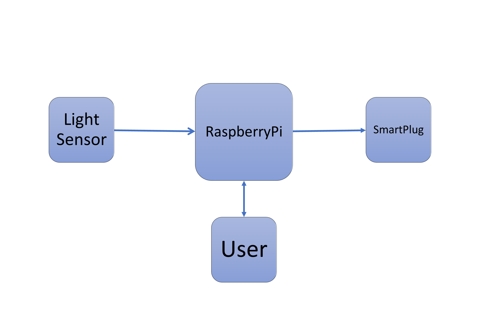

# Peer-graded Assignment: Assignment 2: Design Document

## Controlling a wireless SmartPlug for a water heating tank system

| Design options | Market Brand | RaspberryPi+SmartPlug | Arduino+SmartPlug |
|:---------------|:------------:|:---------------------:|:-----------------:|
| Cost           | $ 100-120    | $ 60                  |  $ 50             |
| Size           | Small        | Small                 |  Small            |
| Difficulty     | Low          | Medium                |  Medium-High      |
| Knowledge      | Low          | From this Course      |  No Knowledge     |
| Security       | None         | None                  |  None             |
| Time           | Fast         | Fast                  |  Fast             |
| Customizable   | Yes (Costly) | Yes (High)            |  Yes (High)       |

**Market Brand**

This is, the easiest and not the funny option, which is buying IoT devices and using them through a mobile application. The PROs are that you do not need to worry about the coding, sockets, connections, or anything since everything is controlled by an already application. 

The CONS are that some devices might be a little bit expensive for the purpose needed, and must be restricted to the brand in case of further customizations. The interaction between devices would be limited by the app.

**RaspberryPi+SmartPlug**

We can make use of a RapsberryPi with WiFi as a server and a SmartPlug (it has to be OpenSource) as a client. By establishing a socket between these two devices, it would be possible to create communication for running a program on the network. A socket is bound to a port number so that the TCP layer can identify the application that data is 
destined to be sent. 

This second option is a little bit more tedious than the previous one since we have to write our own server-client code using sockets to send data received by the photoresistor and communicate to both the server and the client that everything is okay. 

Along this specialization, we have learned the basic idea of how a socket works, so it can be implemented. Unfortunately, we did not learn about security and would be expanded and improved in the future.

**Arduino+SmartPlug**

Since we did not learn a lot on how Arduino communicates with the outer world via WiFi or Ethernet, I would discard the feasibility of this option, even if I think that It could be possible.

Since we did not learn how Arduino communicates with the world, Also, Arduino doesn’t have a USB port, unlike Raspberry Pi, things will be more complicated. 

----

I would choose the Option "RaspberryPi+SmartPlug" because of:

- It is an intermediate level between the options presented here
- we have acquired enough knowledge with this specialization
- It would require working on security
- It can be easily expanded with more sensors.

A diagram is shown below:
